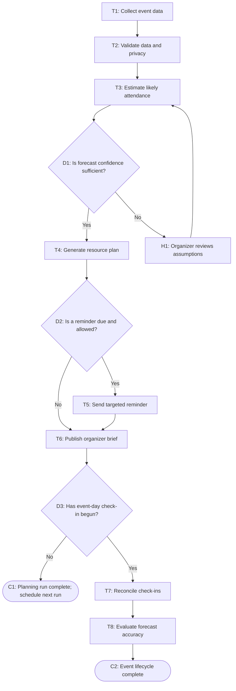

# Workflow of Tasks

*Replace all bracketed prompts with information specific to your proposed system. Delete instructional text that does not belong in your final specification. Add or remove task sections as needed. Every task shown in the general workflow must have a corresponding task specification below.*

## 1. Workflow Overview
### 1.1 Workflow Goal
This workflow supports the system goal defined in `my_first_agent/README.md`.

### 1.2 Workflow Trigger

The workflow starts when an organizer requests an updated attendance estimate or when the scheduled daily planning run occurs during the registration period. It also starts at the event-day check-in window so the system can reconcile forecasts with actual attendance.

### 1.3 Completion Condition at Runtime

A planning run is complete when the system has produced a dated attendance estimate with an uncertainty range, generated a resource recommendation, recorded any required organizer decision, and either sent an allowed targeted reminder or determined that no reminder is needed. The event lifecycle is complete after check-in data is reconciled and the forecast-accuracy summary is saved.

### 1.4 General Workflow

The system collects current registrations, cancellations, confirmation responses, event details, and relevant historical attendance rates. It validates data quality, removes unnecessary personal information from the planning dataset, estimates likely attendance with an uncertainty range, and translates that estimate into recommended quantities for food, drinks, and swag. The workflow produces an organizer-facing brief that identifies the estimate, confidence level, assumptions, and recommended actions.

If the data is incomplete, stale, inconsistent, or below the confidence threshold, the system routes the assumptions and proposed estimate to an organizer for review before publishing the recommendation. If a participant update is needed and the participant has not exceeded the communication limit, the system sends one targeted confirmation or reminder; otherwise, it records that no message is needed. On event day, check-ins are reconciled with the latest forecast, and the system records forecast error and resource-planning performance for future events.

### 1.5 Workflow Diagram

